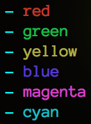

# Overview
`printfc` wraps `printf(<format>, ...)` to include color specification for each parameter. The API is identical, but with a small extension. Prefixing percent signs in the format string with `[<color identifier]` causes the corresponding argument to be printed in color.


# Sample Usage
```
// Just like printf...
printfc("[r]%s", "red text");
printfc("[g]%s", "green text");
printfc("[r]%s [g]%s", "red", "green");

// Other type specifiers work too.
printfc("[y]%d", 52334);

// If no color color specifications are performed, normal text
// colors are used.
printfc("[r]%s %s", "red", "normal");
```


# Available Colors
Each color is specified with its first character (in lowercase, i.e. `[r]` for red). The following are currently available:


 
More will be added soon.


# Installation
This project is managed by [Kit](https://github.com/dasmithii/kit). If you use Kit in your developement workflow, simply `#include <kit/printfc.h>` to import necessary symbols. If not, just grab these source files directly.